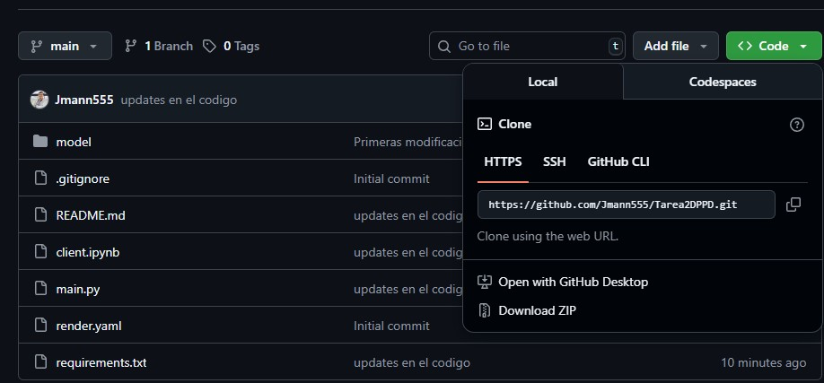

# Tarea 2- Desarrollo de Proyectos y Producto de Datos

Alumno: Julio Felipe Assmann Segura

## Descripción del proyecto

Este proyecto consiste en la implementación de un modelo de Machine Learning como API, se utilizara un YOLO generado en Visualización Computacional sobre una clasificación de perros Salchichas!🐕

Para ello realizaremos 3 labores 
- 1. Implementación de la API en FastAPI
- 2. Despliegue de la API en Render
- 3. Pruebas desde un Cliente Externo

## Comenzando

Es importante recordar que deben haber bajado todos los archivos a una carpeta y en la terminal de Anacondallegar a este Direciorio
```
TAREA2DPPD/ (este directorio)
├── model/ (el modelo a utilizar)
│   └── exp3_lr0.001_wd1e-05_optAdamW_best.pt 
├── assets (carpeta con 3 imagenes de ejmplo)
├── main.py   (Backend FastAPI con modelo de predicción serverless.)
├── requirements.txt (dependencias necesarias para utlizar el modelo)
└── test.ipynb   (notebook de ejmplo que utiliza la Url de render para probar la detección)
```
## Pasos previos usando Conda:
#### Prerequisito : tener [CONDA](https://docs.conda.io/en/latest/) instalado en tu computador:
Vamos a usar Conda para construir un entorno virtual nuevo..

#### 1. Creando el entorno virtual (Virtual Environment)
Asumiremos que tenemos instalado conda. El primer paso es crear un nuevo enviroment para desarrollar. Para crear uno usando Python 3.12 debemos ejecutar el siguiente comando:
```
conda create --name producto-datos-lab python=3.12
```
Luego debemos activarlo usando el comando:
```
conda activate TAREA2DPPD
```
Todo el trabajo que realicemos con este código será en este entorno. Así que al trabajar con estos archivos siempre tienen que estar activas estas dependencias.

#### 2. Instalando las dependencias usando PIP
Antes de seguir, verifica que en el terminal de Anaconda estés dentro del directorio `TAREA2DPPD` el cual incluye el archivo `./requirements.txt`. Este archivo enlista todas las dependencias necesarias y podemos usarlo para instalarlas todas:

```
pip intstall -r ./requirements.txt
```
Este comando puede demorar un rato dependiendo de la velocidad del computador y la de la conexión a Internet.

### 3. Implementación desde Github
Puedes usar este repositorios directamente o puedes generar una copia de la siguiente forma: 
1. ingresa a este Github ( si por casualidad obtuviste este codigo por otro lado) [Gvagg555/Tarea2DPPD](https://github.com/Jmann555/Tarea2DPPD) 

2. Presiona el boton verde que dice `<> Code` arriba de las carpetas de archivo como en la imagen a continuación:


3. Copia la URL del repositorio , o tambien puedes abrirlo mediante GitHub Desktop.
```
https://github.com/Jmann555/Tarea2DPPD.git
```

4. Abre TerminalTerminalGit Bash.

5. Cambial al directorio o locación que quieras dejar tu directorio clonado.

6. Escribe `git clone` y luego pega la URL que copiastes anteriormente.
```
git clone https://github.com/Jmann555/Tarea2DPPD.git
```
 y listo 😉

### 4. Generación de la Api mediante Render

Esta api ya se encuentra creada y puedes usarla libremente!, solo te pido que antes de utilizar sus beneficios ingresa a la siguiente [URL de Render](https://sera-perrosalchicha-o-no.onrender.com) para poder activar la API antes de su uso ( ya que está realizado con el plan free 😄 )

```
https://sera-perrosalchicha-o-no.onrender.com
```

De no ser asi, y tu plan es utilizar este codigo para aprendizaje, favor sigue los siguientes pasos para poder implementarlo tu solo:

- Ingresa a [Render](https://dashboard.render.com/)
- Inicia sesión o crea tu cuenta.
- Agrega tu cuenta de Github en donde tienes copiado el repositorio de perros Salchicha!
- En tu Dashboard crea un nuevo Web Service.
- Al tener tu cuenta Github integrada podrás elegir el repositorio desde una lista 
- Ingresa el Nombre de tu web service,  para el lenguaje yo utilice `Python 3` y el plan Free😊
- Render tomara `requirements.txt` e instalara todo , para poder implementarse.
- Luego de varios minutos , su Detector de perros Salchicha se encontrará Online y listo para utilizar. 
- recuerda tomar la URL de tu API para utlizarlo. 

### Utilización de la API.

Para utilizar recordamos que previamente debes activar la API ingresando a la siguiente URL:
```
https://sera-perrosalchicha-o-no.onrender.com
```
Puedes utlizar el notebook client como referencia, de lo contrario el codigo a utilizar es el sigiente:

- Llamamos las librerias necesarias:
```
import requests
import json
from IPython.display import Image as IPImage 
```

- Cargamos la URL de la API de perros salchicha!
```
API_URL = "https://sera-perrosalchicha-o-no.onrender.com/predict" 
```

- Cargamos la url de tu imagen a probar ( te recomiendo dejarlas en la carpeta assets) en ella le ponemos además el nivel de confianza que queremos utilizar. 
`NOTA: el codigo transforma las imagenes a 480x480 para poder ser evaluadas de la misma forma que el modelo`
```
api_params = {'confidence': 0.99}

IMAGE_PATH = "./assets/pruebinha.jpg"

# --- Optional: Display the image you're sending ---
print(f"Sending this image to the API:")
display(IPImage(filename=IMAGE_PATH, width=400))


# --- Send the Request ---
try:
    # Open the image file in binary read mode
    with open(IMAGE_PATH, "rb") as image_file:
        files = {"file": (IMAGE_PATH, image_file, "image/jpeg")}
        response = requests.post(API_URL, files=files,params=api_params)

    # --- Process the Response ---
    if response.status_code == 200:
        print("\n✅ Success! API returned the following detections:")
        detections = response.json()
        # Pretty-print the JSON response
        print(json.dumps(detections, indent=2))
    else:
        print(f"\n❌ Error: Received status code {response.status_code}")
        print("Response Text:", response.text)

except FileNotFoundError:
    print(f"❌ Error: The file was not found at {IMAGE_PATH}")
except requests.exceptions.RequestException as e:
    print(f"❌ Error: A connection error occurred: {e}")
```

y Listo!, espero que disfrutes el modelo y te sirva para poder diferenciar los perros salchichas. 

`NOTA 2: El modelo fue entrenado con 200 imagenes, sus niveles de confianza son : `
```
| Métrica                 | Clase           | YOLOv8-cls  | Comentarios |
| :---------------------- | :-------------- | :---------------------- | :--------------------------------- |
| **Precisión** | `dachshund`     |        0.97          |                                    |
|                         | `not_dachshund`        | 0.95          |                                    |
| **Recall (Sensibilidad)**| `dachshund`     |        0.97          |                                    |
|                         | `not_dachshund` |       0.95         |                                    |
| **F1-Score** | `dachshund`     |        0.97         |                                    |
|                         | `not_dachshund` |       0.95          |                                    |
| **Accuracy (Exactitud)**| Overall         |      0.96          |                                    |
| **Macro Avg F1-Score** | Overall         |       0.96          | _Promedio sin ponderar_            |
| **Weighted Avg F1-Score**| Overall         |      0.96         | _Promedio ponderado por soporte_   |
|                         |                 |             |                         |                                    |
| **Tiempo Inferencia (CPU)**| Promedio/imagen (test 50%)|      0.497 s        |                                    |
|                         | Promedio/imagen (test 1000%) |       0.925 s          |             |
|                         |                 |             |                         |                                    |
| **Matriz de Confusión** | `dachshund` TP  |       30         | Verdaderos Positivos               |
|                         | `dachshund` FN  |        1          | Falsos Negativos                   |
|                         | `dachshund` FP  |        1         | Falsos Positivos                   |
|                         | `dachshund` TN  |        18         | Verdaderos Negativos               |
```